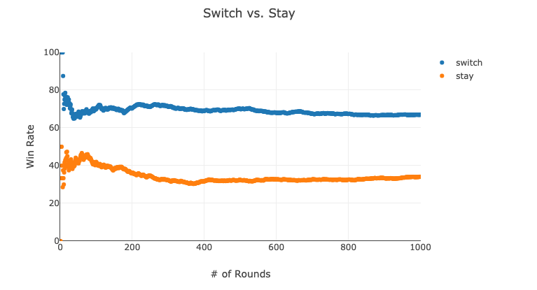

# Monty Hall Game Simulator

A simple simulator for the Monty Hall problem, demonstrating the dominant strategy through **Proof by Simulation**. 

A mathematical explanation is available on: https://www.youtube.com/watch?v=4Lb-6rxZxx0 BUT one might still be skeptical of this fact so I created a simulator to show definitive proof of the dominant strategy by allowing users to play and simulate thousands of games which arrives to the same conclusion.

## Overview
In the Monty Hall problem, a contestant is presented with three doors: behind one door is a car, and behind the other two are goats. After the contestant picks a door, the host (who knows what is behind each door) opens one of the remaining doors to reveal a goat. The contestant is then given the option to either stick with their original choice or switch to the other remaining door.

 **The dominant strategy is to always switch doors**, and this simulator demonstrates why through thousands of games.

## Features

- Lets you play the Monty Hall game
- Allows you to simulate thousands of games to analyze the success rate of different strategies (sticking vs switching).
- Provides statistical proof that switching doors is the better strategy.

Try it out for yourself: https://www.enricodelarosa.tech/montyhallsimulator/

#### Personal Note

I started this project back when I was still starting out in dev. I was "required" to virtually attend a talk with my video on. Ended up finishing it and finally made peace with the monty hall game.

